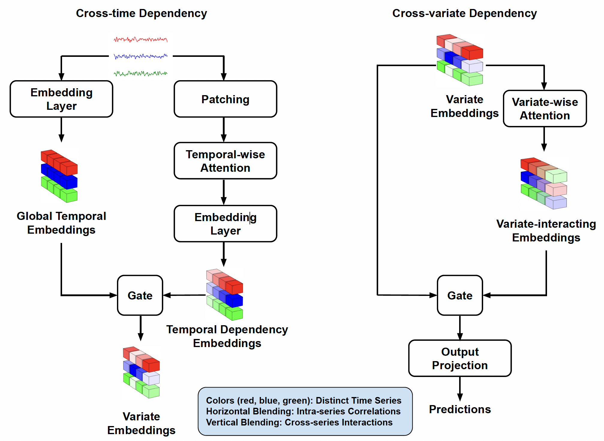
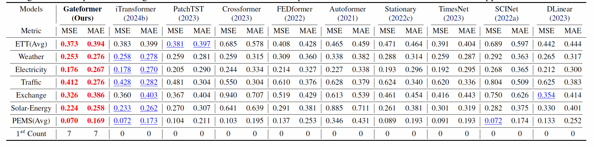
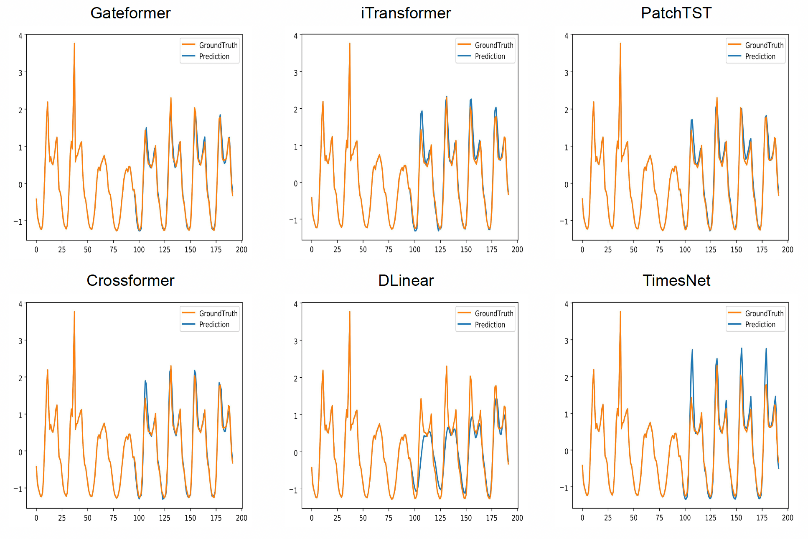
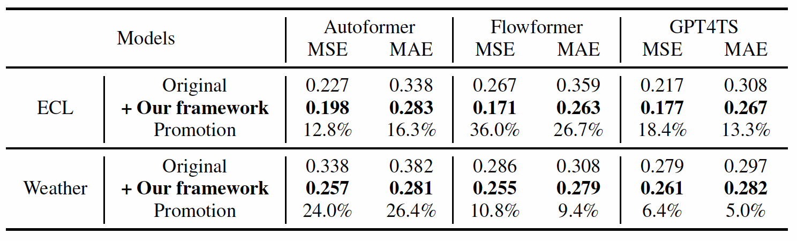
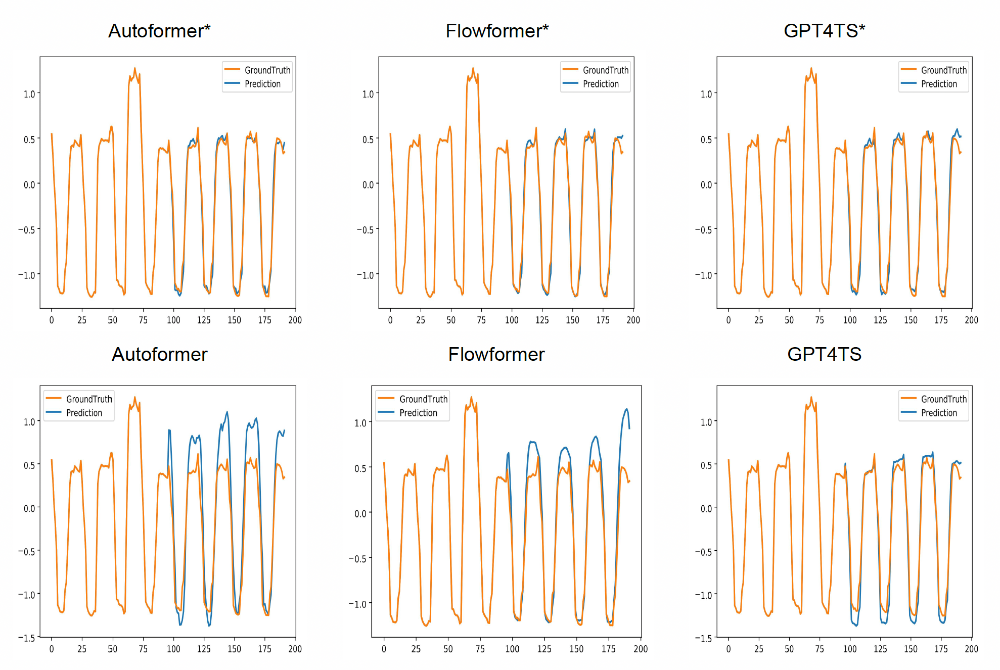
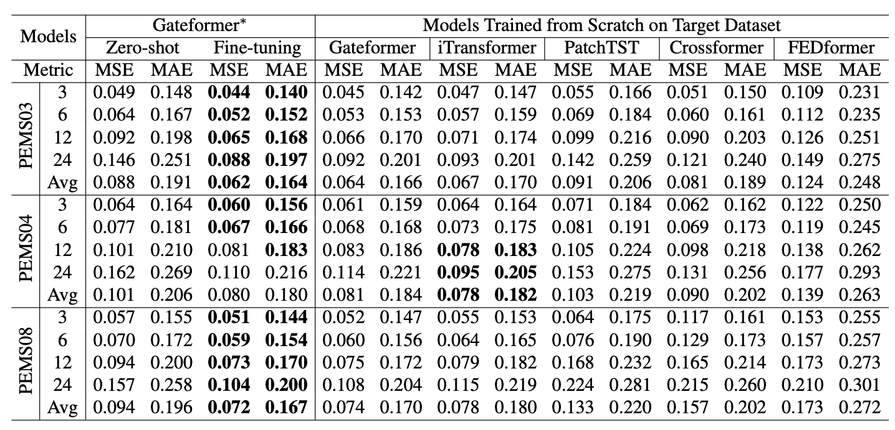

# Gateformer: Advancing Multivariate Time Series Forecasting through Temporal and Variate-Wise Attention with Gated Representations

We provide the PyTorch implementation of **Gateformer**, a Transformer-based model for multivariate time series forecasting that integrates temporal (**cross-time**) and variate-wise (**cross-variate**) attention with **gated representations**. The full paper can be found at [arXiv](https://arxiv.org/abs/2505.00307).

## Architecture
The model encodes each variate’s series independently through two distinct pathways to obtain variate-wise representations: (1) temporal dependency embeddings that capture **cross-time dependencies** through patching and temporalwise attention, and (2) global temporal embeddings that encode global temporal patterns through an MLP. These complementary embeddings are integrated through a gating operation to form variate embeddings, which serve as input for cross-variate dependency modeling. Variate-wise attention is then applied on variate embeddings to model **cross-variate dependencies**, producing variate-interacting embeddings. Finally, a copy of the variate embeddings (without interaction) is combined with the variate-interacting embeddings through gating to regulate cross-variate correlations. The resulting output is then passed through a projection layer to generate predictions.
<p align="center">

</p>

## Result of Multivariate Long-term Forecasting

We evaluate Gateformer against competitive baseline models on widely recognized benchmark datasets, using MSE and MAE as evaluation metrics where **lower values indicate better performance**.

<p align="center">

</p>

### Visualization

<p align="center">

</p>

## Performance Boosting using our framework

Our proposed framework seamlessly integrates with Transformer-based and LLM-based models, delivering up to 20.7% performance improvement compared to the original models.

<p align="center">

</p>

### Visualization

∗ denotes models integrated with our framework.

<p align="center">

</p>

## Representation Learning

We evaluate the representations learned by our model, focusing on their generalization and transferability across datasets. 
A key strength of our method lies in its ability to effectively capture cross-variate correlations, enabling superior generalization and transferability to unseen datasets.

<p align="center">

</p>

## Usage
### 1. Install Dependencies
Install **Python 3.11**, **Pytorch** and other necessary dependencies.
```bash
pip install -r requirements.txt
```

### 2. Download Dataset
Download and place the datasets in the `./dataset/` folder.
All benchmark datasets can be obtained from the public GitHub repository: [iTransformer](https://github.com/thuml/iTransformer)

## Train and Evaluate the Model  
We provide **experiment scripts** for **Gateformer** across all benchmark datasets in the `./scripts/` directory.  

To run an experiment, execute the corresponding script.  
**Example:**
```bash
bash ./scripts/multivariate_forecasting/Electricity/Gateformer.sh
bash ./scripts/multivariate_forecasting/Traffic/Gateformer.sh
bash ./scripts/multivariate_forecasting/Weather/Gateformer.sh
bash ./scripts/multivariate_forecasting/SolarEnergy/Gateformer.sh
```
